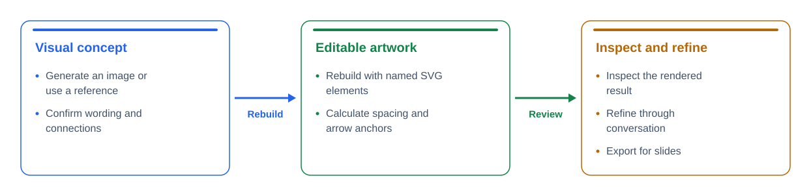

# Skills

Personal collection of reusable Codex skills. Each folder under `skills/` is an independently installable skill.

| Skill | Purpose |
| --- | --- |
| [editable-diagrams](skills/editable-diagrams/SKILL.md) | Generate or use a visual reference, rebuild it as named HTML/SVG artwork, inspect the render, and refine through conversation. |

## Install

Copy the desired skill folder into your Codex skills directory:

```bash
mkdir -p "${CODEX_HOME:-$HOME/.codex}/skills"
cp -R skills/editable-diagrams "${CODEX_HOME:-$HOME/.codex}/skills/"
```

If it is already installed, review your local changes before replacing it. Start a new Codex session after installation if the skill does not appear immediately. The skill works with available image-generation and rendering tools; the Python starter itself uses only the standard library.

## Use

```text
Use $editable-diagrams to generate a concept for a three-stage research
pipeline, then rebuild it as editable HTML/SVG. Keep the background transparent.
```

```text
Use $editable-diagrams to recreate this reference image closely.
Keep the wording exactly as supplied and inspect the exported result.
```

Later edits can use ordinary descriptions:

- “Give the arrow between the first two stages more space.”
- “Remove the title and keep it removed in future exports.”
- “Make the review stage green.”

Stable IDs and saved artifact decisions let the agent locate elements and preserve accepted choices. The working source remains editable; the visual concept is not used as a flattened final image.

## Try the starter

```bash
python3 skills/editable-diagrams/scripts/build_diagram.py \
  skills/editable-diagrams/assets/starter.json \
  --output examples/editable-diagrams/workflow
```

Open `examples/editable-diagrams/workflow.html` in a browser. It contains SVG and 4096px-wide PNG download buttons. The standalone SVG and JSON source are included too.



The starter supports horizontal pipelines with forward connections between adjacent nodes. Card text wraps, card heights grow, arrow anchors follow geometry, and gutters expand for labels. It is deliberately small: branching graphs and close reconstruction of complex references need a tailored layout. Font widths are estimated, so visual inspection remains required. SVG text uses Arial with fallbacks; exact metrics can vary by machine. Outlining a separate export is an option when exact font portability is necessary.

`decisions` in each scene records accepted choices; it is descriptive context for the agent, not executable layout configuration. Change the actual scene fields to implement those choices. Preserve IDs when renaming or moving elements. Color accepts six-digit hex codes, and `background` accepts a hex code or `transparent`.

## Develop and verify

```bash
python3 -m unittest discover -s tests -v
```

Tests cover geometry after edits, long labels, text escaping, stable IDs, transparency, invalid connections, and reproducible examples. GitHub Actions runs them on pushes and pull requests. Visual inspection is a separate required part of the skill workflow; these tests do not replace it.

Add future skills under `skills/<skill-name>/` with a `SKILL.md` and only the supporting files they need. Keep examples and repository tests outside installable skill folders.
